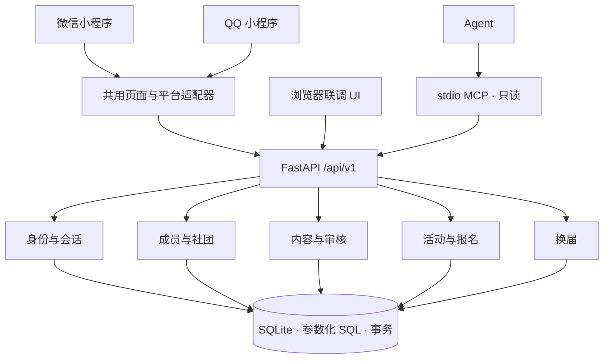

# 同频 v0.1：架构与首版范围

## 1. 输入与决策

输入是本次对话交付的 26 页同频原型及产品方案（2026-09-21）。它是产品设计，不是可直接复用的后端。仓库检查时为空。

本轮授权包含架构、开发、测试与推送。具体技术选型是本轮实施假设，并未获得额外一次人工签字；通过 feature/mvp-foundation 的 PR 审阅后再合并。“mcp”存在 MVP/MCP 歧义，因此应用首版与只读 MCP 两者明确分开；不把 MCP 当作小程序运行框架。

目标：让一个真实账号在一个社团内完成申请、投稿、审核、反馈、知识查找与活动报名，权限与数据由服务端保存。首批场景为少量创作型社团；不假定已签约学校或已获平台准入。

## 2. 模块地图与依赖

| 模块 ID | 当前责任 | 依赖 |
| --- | --- | --- |
| identity | 宿主身份交换、会话、退出 | storage |
| clubs | 社团目录、成员申请与审批、资源权限 | identity, storage |
| content | 四类帖子、图片、评论、搜索、审核 | clubs, storage |
| events | 活动发布、报名、候补、取消与递补 | clubs, storage |
| governance | 换届双方确认与审计 | clubs, storage |
| clients | 原生微信/QQ 页面、浏览器联调 UI | HTTP API |
| mcp | 有明确令牌的只读工具 | HTTP API |

构建顺序：storage → identity/clubs → content → events/governance → clients → mcp。

采用模块化单体，不引入微服务、消息队列、Redis、ORM、插件总线或通用 Repository 框架。业务按责任拆文件；连接代码不写业务规则，HTTP 路由不执行 SQL。服务层直接使用参数化 SQL，避免为单一数据库新增无消费者的适配接口。数据库写事务由服务层拥有。

## 3. 核心不变量

1. 登录身份和社团资格分开。账号以 `(provider, subject)` 唯一，不按昵称合并微信/QQ 身份。跨端账号绑定暂未实现。
2. 私域正文、搜索、成员名册、图片及审核队列每次读写都检查当前成员关系；不能相信前端角色。权限不写入长寿命 JWT。
3. 投稿及评论默认 pending；作者和当前管理者可见待审内容，其他成员只能看 approved。本版全部社内可见，没有公开作品开关。
4. 作品图片不在静态目录；读取也鉴权。上传只接受受限大小的 JPEG/PNG/WebP，解码后重编码，去除原图元数据。没有任意 URL 抓取。
5. 报名 `(event_id, user_id)` 唯一。在 `BEGIN IMMEDIATE` 内核对容量与写入；满额进入 waiting，取消报名按先后递补。开始或取消后不能报名。
6. 活动取消会使所有报名失效。没有假签到按钮，也不把候补显示成入场成功。
7. 换届必须两个独立的现有账号确认；候选人必须仍是有效成员；交接完成后旧社长立即失去管理权。交接在单一事务内完成并记录审计。
8. API 错误形如 `{error: {code, message}}`；网络失败不伪装成成功或空列表。

## 4. 数据模型

- users：应用账号，保存宿主类型与 subject；对外不返回 subject。
- sessions：令牌摘要、user_id、expires_at；原始令牌仅在登录时返回，退出立即撤销。
- clubs：名称、简介、社规、owner_id；所有权的唯一真相为 owner_id。
- memberships：club_id/user_id 联合主键，pending/active/rejected 与申请理由。
- posts：club_id/author_id、kind、正文、反馈目标、status、client_id、可选 media_id。
- comments：post_id/author_id、正文、审核状态。
- media：所属社团与上传者、编码后图片、类型；首版 SQLite BLOB，限制单图，便于一致备份。
- events / registrations：时间、容量、状态；报名联合主键和递补顺序。
- handovers：原负责人、继任者、有效期、状态。
- audit：操作者、社团、动作、对象、时间，不保存密钥或正文副本。

迁移使用 `PRAGMA user_version`。v0.1 只有初始迁移；再次启动不可重建或清空数据。种子数据仅在显式 demo 模式且空库时写入。备份采用 SQLite backup API；禁止只复制运行中的 WAL 主文件。

## 5. 页面到能力的落地

| 原型页面 | v0.1 处理 |
| --- | --- |
| 动态、社团、社团详情 | 真实 API 列表，按社团筛选；游客只有社团公开介绍 |
| 发布、作品详情、我的投稿 | 文本及单张图片、反馈目标、待审状态、作品/知识/提问/闲聊 |
| 知识库、知识详情、搜索 | 使用同一内容模型，kind=knowledge；社内检索 |
| 活动列表、详情、个人报名 | 创建、报名/候补、取消报名、递补、活动取消 |
| 社长工作台、投稿审核、成员管理 | 服务端权限、入社审批、帖子和评论审批 |
| 换届 | 发起、继任者确认、撤销旧负责人权限 |
| 邀请、登录、入社状态、个人页 | 社团介绍入口、宿主登录、申请、个人身份；邀请参数深链尚未实现 |
| 消息、收藏、隐私偏好、轻互动、建社申请 | 暂不提供完整产品能力，不放置假可用按钮 |
| 活动现场核销、知识版本/提名、举报申诉 | 后续范围；试点前需明确人工治理通道 |

浏览器 UI 是联调与验收入口，不宣称是微信/QQ 小程序。原生源在 mini/；构建脚本只做明确的 wx/qq 平台选择、模板指令和扩展名转换，不自行实现框架。两端产物需要分别在对应开发者工具及真机验收。

## 6. 认证与发布边界

浏览器联调采用内存 Bearer 会话；刷新后需要重新登录，避免把长期令牌写入浏览器存储。小程序令牌放在宿主本地存储，退出清理；服务端 8 小时过期并每次查库鉴权。

demo 登录必须显式开启，默认关闭；production 模式与 demo 同时出现时拒绝启动。demo 数据为虚构，不接受真实学生资料。真实 code 登录由服务器交换 code，不接受客户端传 openid，不向客户端返回 session_key。QQ/微信没有凭据或交换失败时明确报错，不回退到 demo。

生产运行还需要：运营主体/类目与资质确认、正式隐私说明与删除流程、内容治理与申诉、HTTPS 和合法请求域名、平台订阅消息联调、备份恢复演练、真机测试。没有这些验收证据，不得标注“已上线”。SQLite 首版仅单实例小规模试点；增加并发写入或多实例前，再以负载数据决定 PostgreSQL 迁移。

## 7. MCP 契约

stdio MCP 仅提供 list_clubs、list_posts、get_post、list_events。工具通过 HTTP API 复用 Bearer 会话，不直接读数据库、不携带管理员万能令牌、不接受任意 URL、不提供写工具。stdout 只输出 JSON-RPC；诊断写 stderr。令牌过期时返回工具错误，由操作者重新登录。

## 8. 验证与回滚

验证分 API/真实 SQLite 集成测试、原生构建与 JS 语法检查、HTTP+浏览器工作流（本环境通过受控桥接测试，不是浏览器原生 HTTP 导航）、MCP 协议测试。平台 code 交换通过外部响应替身测试；没有 AppID 的真机测试列为阻塞，不记成通过。

Git 按架构、后端基础闭环、MCP、客户端、验证与交付拆提交。主分支不自动合并；推送后读取远端分支与树确认。回滚先停止写入、备份数据库，再回退代码；涉及破坏性迁移时另行制定数据回滚方案。
